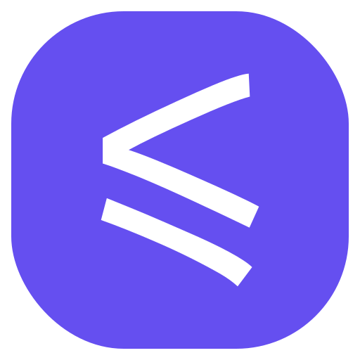

<div align="center"></div>
<h1 align="center">WebAssembly Language Tools</h1>

WebAssembly Language Tools aims to provide and improve the editing experience of WebAssembly Text Format.
It also provides an out-of-the-box formatter (a.k.a. pretty printer) for WebAssembly Text Format.

## 📌 Features

<details>
  <summary>Code Completion</summary>
  <picture>
    <source media="(prefers-color-scheme: light)" srcset="https://github.com/user-attachments/assets/0185b411-a6cf-4372-9232-39e1c211a414">
    <source media="(prefers-color-scheme: dark)" srcset="https://github.com/user-attachments/assets/c91ced71-1f49-41bc-b153-56230236d5bb">
    
  </picture>
</details>

<details>
  <summary>Go to Definition</summary>
  <picture>
    <source media="(prefers-color-scheme: light)" srcset="https://github.com/user-attachments/assets/cf803292-f17f-46f2-b091-79468e3ed73f">
    <source media="(prefers-color-scheme: dark)" srcset="https://github.com/user-attachments/assets/7006d7cd-6ebc-46dc-804c-0a7c06defbdc">
    
  </picture>
</details>

<details>
  <summary>Find References</summary>
  <picture>
    <source media="(prefers-color-scheme: light)" srcset="https://github.com/user-attachments/assets/f680a504-132d-469a-bd02-17f73ecb83f1">
    <source media="(prefers-color-scheme: dark)" srcset="https://github.com/user-attachments/assets/55b1b3be-4f9c-4870-a02d-826f4f18c2ba">
    
  </picture>
</details>

<details>
  <summary>Hover</summary>
  <picture>
    <source media="(prefers-color-scheme: light)" srcset="https://github.com/user-attachments/assets/30e9e84b-58c0-44ab-a249-da10f234d705">
    <source media="(prefers-color-scheme: dark)" srcset="https://github.com/user-attachments/assets/59520e97-8b34-4440-ada8-7f16cf2e1c2d">
    
  </picture>
</details>

<details>
  <summary>Rename</summary>
  <picture>
    <source media="(prefers-color-scheme: light)" srcset="https://github.com/user-attachments/assets/fc566c85-e99d-4cc6-93dc-a3e49248e745">
    <source media="(prefers-color-scheme: dark)" srcset="https://github.com/user-attachments/assets/60b65b98-55e4-4cee-9ffd-3531466de2fb">
    
  </picture>
</details>

<details>
  <summary>Document Symbols</summary>
  <picture>
    <source media="(prefers-color-scheme: light)" srcset="https://github.com/user-attachments/assets/91ab73f6-577e-445e-913f-f16c754b9701">
    <source media="(prefers-color-scheme: dark)" srcset="https://github.com/user-attachments/assets/5447a407-fba2-4e65-ab45-9ef423009999">
    
  </picture>
</details>

<details>
  <summary>Diagnostics</summary>
  <picture>
    <source media="(prefers-color-scheme: light)" srcset="https://github.com/user-attachments/assets/7f90d054-7a0b-4a59-8239-9927a2cec14f">
    <source media="(prefers-color-scheme: dark)" srcset="https://github.com/user-attachments/assets/c2db6cc7-3c4c-428c-a1ef-4e5464095da8">
    
  </picture>
</details>

<details>
  <summary>Inlay Hint</summary>
  <picture>
    <source media="(prefers-color-scheme: light)" srcset="https://github.com/user-attachments/assets/e63e0ed1-05ab-42bb-9180-4611f008a198">
    <source media="(prefers-color-scheme: dark)" srcset="https://github.com/user-attachments/assets/234ff428-f0e6-49f9-80e9-97417ea99e24">
    
  </picture>
</details>

<details>
  <summary>Code Action</summary>
  <picture>
    <source media="(prefers-color-scheme: light)" srcset="https://github.com/user-attachments/assets/2048edca-f542-4bdf-b2e8-a57c49559ccc">
    <source media="(prefers-color-scheme: dark)" srcset="https://github.com/user-attachments/assets/73052830-26dd-4434-b6ed-84ec742434c9">
    
  </picture>
</details>

<details>
  <summary>Formatting</summary>
  <picture>
    <source media="(prefers-color-scheme: light)" srcset="https://github.com/user-attachments/assets/3f164aa7-12ec-4377-a510-cb325a8c0a98">
    <source media="(prefers-color-scheme: dark)" srcset="https://github.com/user-attachments/assets/9f56b529-a390-4db1-9468-73e1875146d2">
    
  </picture>
</details>

<details>
  <summary>Semantic Highlighting</summary>
  <picture>
    <source media="(prefers-color-scheme: light)" srcset="https://github.com/user-attachments/assets/1d4fa62b-48fb-4d12-a2f7-392c8805dc9f">
    <source media="(prefers-color-scheme: dark)" srcset="https://github.com/user-attachments/assets/06c94113-4698-4b4d-8ca2-e2edc890ff02">
    
  </picture>
</details>

<details>
  <summary>Call Hierarchy</summary>
  <picture>
    <source media="(prefers-color-scheme: light)" srcset="https://github.com/user-attachments/assets/374db3a2-6b0c-4235-9a8c-c37e196ced53">
    <source media="(prefers-color-scheme: dark)" srcset="https://github.com/user-attachments/assets/8bbb9e85-4750-41a7-958f-f55a2ec4c6ca">
    
  </picture>
  <picture>
    <source media="(prefers-color-scheme: light)" srcset="https://github.com/user-attachments/assets/97797d14-77fb-4505-b97c-70c6d0c80f81">
    <source media="(prefers-color-scheme: dark)" srcset="https://github.com/user-attachments/assets/c993d747-3744-465f-a520-2ec6a09158c9">
    
  </picture>
</details>

<details>
  <summary>Signature Help</summary>
  <picture>
    <source media="(prefers-color-scheme: light)" srcset="https://github.com/user-attachments/assets/3beaeb93-63ca-469a-bded-bbff53e9eca1">
    <source media="(prefers-color-scheme: dark)" srcset="https://github.com/user-attachments/assets/87314ee1-7ffe-4aa7-ac0a-9931108ed430">
    
  </picture>
</details>

## 🍵 Usage

We don't provide pre-built binaries at the moment.

If you have installed Rust, you can run Cargo to install:

```shell
cargo install wat_server
```

### Editor Support

- Visual Studio Code: Install the [WebAssembly Language Tools](https://marketplace.visualstudio.com/items?itemName=gplane.wasm-language-tools) extension.
- Neovim: You need to configure manually at the moment:
  ```lua
  vim.api.nvim_create_autocmd("FileType", {
    pattern = "wat",
    callback = function(args)
      vim.lsp.start({
        name = "wasm-language-tools",
        cmd = { "wat_server" }, -- or the absolute path to the binary
        settings = { -- this section is optional
          wasmLanguageTools = { -- must be under the key "wasmLanguageTools"
            format = {},
            lint = { unused = "warn" },
          },
        },
      })
    end,
  })
  -- Optional: Format on save
  vim.api.nvim_create_autocmd("LspAttach", {
    callback = function(args)
      local client = vim.lsp.get_client_by_id(args.data.client_id)
      if client.name == "wasm-language-tools" then
        vim.api.nvim_create_autocmd("BufWritePre", {
          buffer = args.buf,
          callback = function()
            vim.lsp.buf.format({ bufnr = args.buf, id = client.id })
          end,
        })
      end
    end,
  })
  ```
- Zed: Coming soon.
- Helix: Add the following lines to `<config_dir>/helix/languages.toml`:
  ```toml
  [language-server.wasm-language-tools]
  command = "wat_server" # or the absolute path to the binary
  args = []
  config = { format = {}, lint = { unused = "warn" } } # this section is optional

  [[language]]
  name = "wat"
  language-servers = ["wasm-language-tools"]
  ```

## 📜 License

MIT License

Copyright (c) 2024-present Pig Fang
